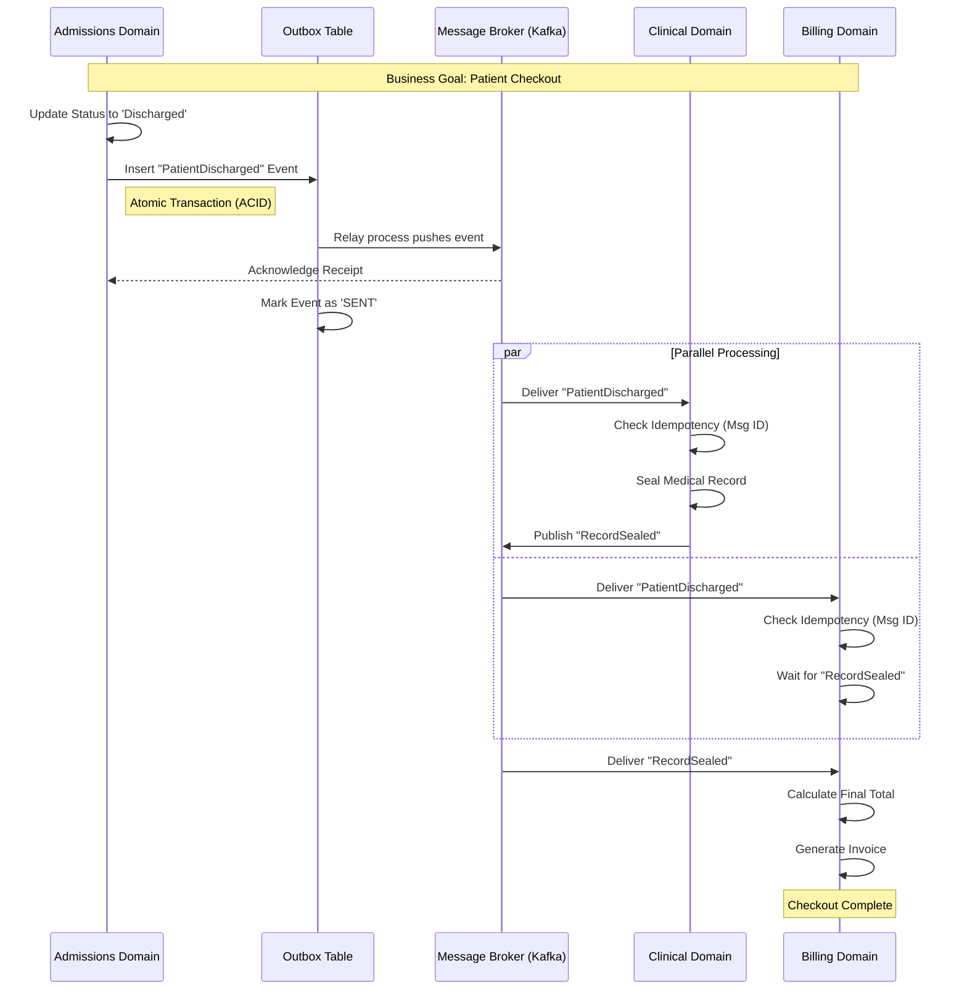
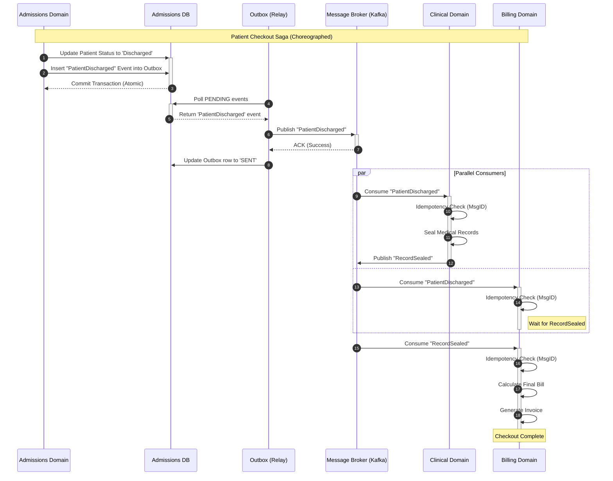
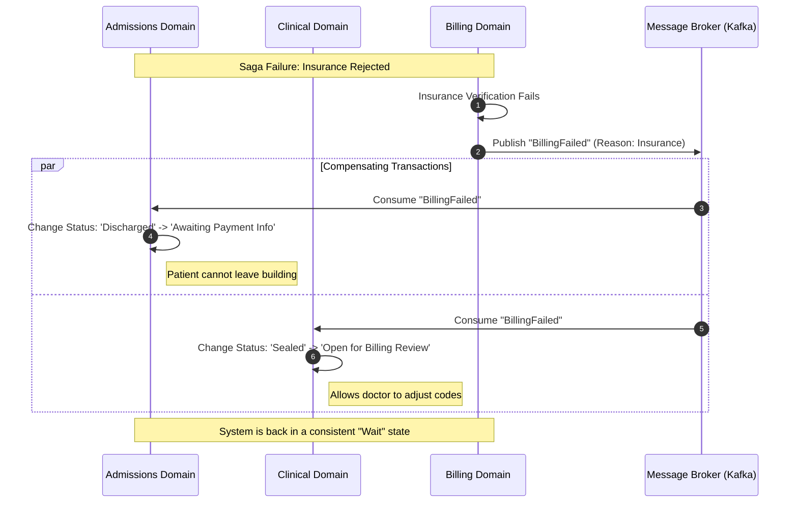
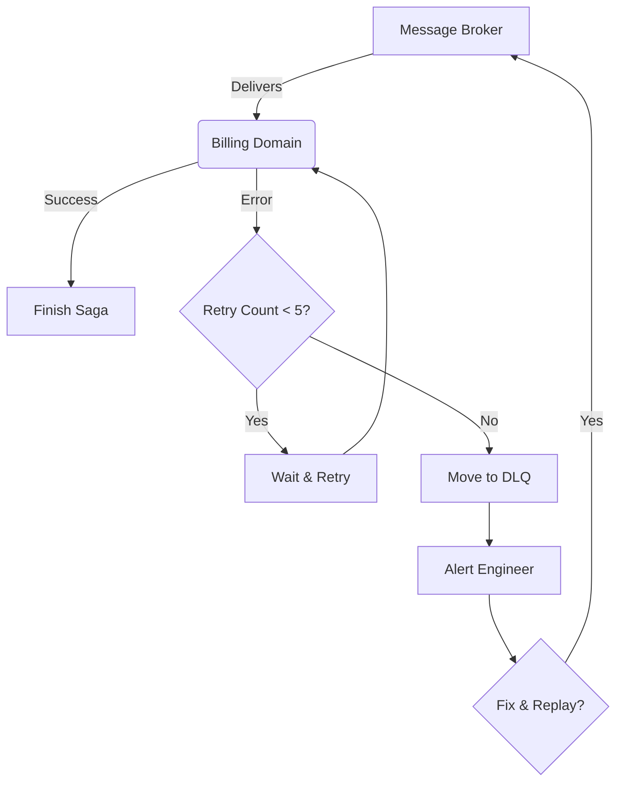

# Domain Driven Design
Domain-Driven Design (DDD) is a software development approach created by Eric Evans in his 2003 book that focuses on building complex software by closely aligning it with the business domain it serves.

## Core Philosophy

The central idea is that the most critical complexity in software projects is understanding the business domain itself, not the technical implementation. DDD provides strategies for managing this complexity through modeling and collaboration.

## Key Concepts

**Ubiquitous Language**
A shared vocabulary between developers and domain experts that's used in code, documentation, and conversations. For example, if business people call something an "Order," the code should have an Order class, not a "Transaction" or "Purchase."

**Bounded Contexts**
Different parts of the system where terms and models have specific meanings. For instance, "Customer" in a sales context might mean something different than "Customer" in a support context. Each bounded context maintains its own model.

**Building Blocks**

- **Entities**: Objects defined by their identity (e.g., a Customer with ID #12345)
- **Value Objects**: Objects defined by their attributes, not identity (e.g., an Address or Money amount)
- **Aggregates**: Clusters of related entities and value objects treated as a unit, with one root entity controlling access
- **Repositories**: Mechanisms for retrieving and storing aggregates
- **Services**: Operations that don't naturally belong to entities or value objects
- **Domain Events**: Something significant that happened in the domain

Think of this like a **Patient** in a large hospital system. If you tried to build one single "Patient" model for the entire hospital, it would be a chaotic mess of data. Instead, different departments (domains) see that same human being through very different lenses.

### The "Patient" Example

Let's take an example of a Patient model, a Patient is modeled differently depending on the **Context**:

---

### 1. The Admissions Domain

When a patient first walks in, the staff cares about **Identity and Logistics**.

* **Attributes:** Name, Home Address, Insurance Provider, Next of Kin.
* **Goal:** Ensure the hospital gets paid and knows who to contact in an emergency.
* **Relationships:** Linked to a **Bed** or a **Room**.

### 2. The Clinical/Medical Domain

Once the patient is in the exam room, the doctor doesn't care about their home address or their insurance deductible. They care about **Vitals and History**.

* **Attributes:** Blood Type, Allergies, Current Heart Rate, Medical History.
* **Goal:** To treat the illness safely.
* **Relationships:** Linked to **Lab Results** and **Prescriptions**.

### 3. The Billing Domain

After the treatment, the finance department looks at the patient as a **Financial Account**.

* **Attributes:** Patient ID, Total Cost of Procedures, Amount Covered by Insurance.
* **Goal:** To issue an invoice and track payments.
* **Relationships:** Linked to **Invoices** and **Payment Gateways**.

---

### Why this is better than one big "Patient" model:

* **Privacy & Security:** The billing clerk doesn't need to see the patient’s sensitive medical history (Clinical Domain). By separating the models, you naturally enforce data privacy.
* **Performance:** The Admissions screen doesn't have to load 10 years of medical lab results just to update a phone number.
* **Simplified Logic:** If the Clinical team wants to change how "Blood Pressure" is recorded (e.g., from a string to a complex object), the Billing team’s code remains completely untouched.

### Comparison Summary

| Domain | Focus | Key Entity Relationships |
| --- | --- | --- |
| **Admissions** | Identity | Patient  Insurance Policy |
| **Clinical** | Health | Patient  Medical Record |
| **Billing** | Finance | Patient  Outstanding Balance |

> **The Big Idea:** Even though it's the same person in the real world, in software, it's better to have three small, specialized models than one "God Model" that tries to do everything.

Would you like to see how these different models "talk" to each other when a patient moves from Admissions to the Exam room?

DDD works best for complex business domains with intricate rules and logic. It's often overkill for simple CRUD applications or technical infrastructure projects. The approach requires significant collaboration with domain experts and ongoing refinement of the model.

## Issue with Bounded Context
In Domain-Driven Design (DDD), when you split a model into multiple **Bounded Contexts** (like Admissions, Clinical, and Billing), you solve the problem of "bloated models," but you create a new challenge: **Data Synchronization.**

If a patient’s identity changes—for example, a legal name change in Admissions—the other domains must be notified without creating a "spiderweb" of direct database dependencies. Here is how that data is shared and synchronized in a professional architecture.

---

### 1. The "Single Source of Truth" (Identity Domain)

Even though models are separate, there is usually one domain that "owns" the identity. In healthcare, this is often the **Admissions Domain** or a dedicated **Master Patient Index (MPI)**.

* When a change happens (e.g., Name Change), the **Admissions Domain** is the only one allowed to perform the initial "Write."
* The other domains (Clinical, Billing) are **Downstream**—they "follow" the lead of the Identity owner.

### 2. Event-Driven Synchronization (The "Push" Model)

This is the most common way to keep domains in sync without coupling them. Instead of the Billing Domain constantly asking Admissions "Did anything change?", Admissions **broadcasts** a message when it does.

**The Workflow:**

1. **The Change:** A clerk updates a name in the **Admissions** system.
2. **The Event:** The Admissions system publishes a "Domain Event" to a message broker (like Kafka or RabbitMQ) called `PatientIdentityUpdated`.
3. **The Content:** The message contains the **Common Identifier** (e.g., `PatientUUID: 1234`) and the new data.
4. **The Consumption:** The **Clinical** and **Billing** domains "listen" for this specific event. When they hear it, they update their own local, simplified versions of the patient model.

---

### 3. Handling the "Common Identifier" Change

What if the **Common Identifier** itself changes (e.g., two records are merged because a patient was accidentally registered twice)? This is the "hardest" problem in distributed data.

* **The "Winner/Loser" Pattern:** The system emits a `PatientMerged` event. It specifies that `ID_A` (the loser) is now `ID_B` (the winner).
* **The Anti-Corruption Layer (ACL):** Each downstream domain (Clinical/Billing) has a small translation layer. If a doctor tries to look up the "loser" ID, the ACL intercepts the request, checks its internal "Redirect Map," and silently fetches the data for the "winner" ID instead.

### 4. Comparison of Sharing Strategies

| Strategy | How it works | When to use it |
| --- | --- | --- |
| **Domain Events** | Admissions sends a "Hey, I changed" message. | **Standard.** Best for decoupling. |
| **API Request** | Billing calls Admissions: "Give me the latest name." | When you don't need to store the name locally. |
| **Shared Kernel** | Both domains use the exact same ID library/database. | **Caution.** Only for very closely related teams. |
| **ACL (Anti-Corruption)** | A "translator" sits in front of the Billing system. | When integrating with old/legacy systems. |

### Summary of Benefits

By using **Event-Driven Synchronization**:

* **Autonomy:** If the Billing database goes offline, the Clinical team can still treat the patient. The Billing system will simply "catch up" on the name-change messages once it's back online.
* **Traceability:** You have a perfect audit log of exactly *when* and *why* a patient’s identity changed across the entire hospital.

## Outbox Pattern
The **Outbox Pattern** is the industry-standard "safety net" for Domain-Driven Design (DDD). It solves the **"Dual-Write Problem"**—the risk that you update your database but the notification to other domains fails (or vice versa).

Here is how it ensures that Admissions, Clinical, and Billing never get out of sync.

---

### 1. The Problem: The "Dual-Write" Trap

Imagine a patient changes their name in the **Admissions** domain. You need to do two things:

1. Update the `Patients` table in the Admissions Database.
2. Send a `PatientNameChanged` message to the **Billing** and **Clinical** domains via a Message Broker (like Kafka or RabbitMQ).

**The Risk:** If your database update succeeds but your internet blips and the Message Broker fails, Admissions has the new name, but Billing still has the old one. You are now "desynchronized."

---

### 2. The Solution: The Outbox Table

Instead of trying to talk to the database and the message broker at the same time, you treat the message as **data**.

You add a new table to your Admissions database called the **Outbox Table**.

**The Atomic Transaction:**
When the name change happens, your code does this in **one single database transaction**:

* **Update** the `Patients` table with the new name.
* **Insert** a new row into the `Outbox` table (e.g., `"Event: NameChanged, Data: {id: 123, name: 'Jane Doe'}"`).

> **Why this works:** Databases are "all-or-nothing" (ACID). Either both the name change AND the outbox message are saved, or neither is. It is impossible to have one without the other.

---

### 3. The Relay: Moving Data to the World

Now that the message is safely sitting in your database "Outbox," a separate, tiny background process (the **Message Relay**) takes over:

1. **Polling:** Every 1 second, the Relay asks the Outbox table: *"Any new messages?"*
2. **Publishing:** It sees the `NameChanged` event and sends it to the Message Broker.
3. **Cleanup:** Once the Broker confirms it received the message, the Relay deletes the row from the Outbox (or marks it as `Processed`).

---

### 4. Visualizing the Workflow

| Step | Action | Responsibility |
| --- | --- | --- |
| **1** | Clerk clicks "Save" | Admissions Domain Logic |
| **2** | Update Patient + Insert Outbox Row | **Database Transaction (Atomic)** |
| **3** | Background Process reads Outbox | Message Relay |
| **4** | Send message to Kafka/RabbitMQ | Message Broker |
| **5** | Clinical & Billing domains receive update | Downstream Domains |

---

### 5. Why this is perfect for your Domain Model

* **Resilience:** If your Message Broker (Kafka) goes down for an hour, the messages just sit safely in the Outbox table. As soon as Kafka is back, the Relay sends them all out. Nothing is ever lost.
* **Performance:** The user doesn't have to wait for the message to be sent over the internet to get a "Success" message. The database write is near-instant.
* **At-Least-Once Delivery:** It guarantees that the other domains *will* eventually hear about the change.

---

### Summary Table: Comparison

| Feature | Direct Sending (Naive) | Outbox Pattern (Professional) |
| --- | --- | --- |
| **Reliability** | Low (Messages can be lost) | **High (Guaranteed delivery)** |
| **Complexity** | Simple | Moderate (Requires extra table/process) |
| **Data Consistency** | Risk of desync | **Eventual Consistency guaranteed** |

### SQL Schema
To implement the Outbox Pattern effectively, you need a schema that is optimized for high-speed writes (from your main application) and efficient reads (for your background relay process).

Here is a professional SQL schema for an Outbox table, followed by a breakdown of why each column exists.

### The SQL Schema (PostgreSQL/Standard SQL)

```sql
CREATE TABLE outbox_events (
    id           UUID PRIMARY KEY DEFAULT gen_random_uuid(),
    aggregate_id VARCHAR(255) NOT NULL,    -- e.g., Patient ID
    aggregate_type VARCHAR(100) NOT NULL,  -- e.g., 'PATIENT'
    event_type   VARCHAR(100) NOT NULL,    -- e.g., 'IDENTITY_UPDATED'
    payload      JSONB NOT NULL,           -- The actual data change
    status       VARCHAR(20) DEFAULT 'PENDING', -- PENDING, SENT, FAILED
    created_at   TIMESTAMP WITH TIME ZONE DEFAULT CURRENT_TIMESTAMP,
    processed_at TIMESTAMP WITH TIME ZONE,
    error_log    TEXT                      -- For debugging failures
);

-- Crucial index for the background relay process
CREATE INDEX idx_outbox_pending ON outbox_events (created_at) 
WHERE status = 'PENDING';

```

---

### Why these columns matter:

* **`aggregate_id` & `aggregate_type**`: These help downstream domains know exactly *what* changed. For example, if Billing receives a message, these columns tell it: "This is for **Patient** (type) **#12345** (id)."
* **`payload` (JSONB)**: This is the "envelope." It contains the actual changes, such as `{ "old_name": "Jane Smith", "new_name": "Jane Doe" }`. Using a JSON type allows you to store different types of events in the same table without changing the schema.
* **`status`**: This is the "traffic light" for your background process.
* **PENDING**: Ready to be sent.
* **SENT**: Safely delivered to the Message Broker.
* **FAILED**: The relay tried but the network was down; it's waiting for a retry.


* **`idx_outbox_pending` (The Partial Index)**: This is a performance "secret weapon." Instead of the background process scanning the entire table (which could grow to millions of rows), it only looks at the tiny fraction of rows where the status is `PENDING`.

---

### How it looks in your Patient Model example:

When a name is updated in the **Admissions Domain**, a single transaction does this:

1. **Update** `admissions.patients` set `last_name = 'Doe'` where `id = 123`.
2. **Insert Into** `outbox_events`:
* `aggregate_id`: `'123'`
* `event_type`: `'PATIENT_NAME_CHANGED'`
* `payload`: `'{"name": "Jane Doe"}'`
* `status`: `'PENDING'`


The background process then sees that **PENDING** row, pushes it to your message broker (like Kafka), and flips the status to **SENT**.


### Idempotency Issue
In a distributed system, "Exactly-Once" delivery is technically impossible because of the "laws of the universe" (networks fail, processes crash, and timeouts happen). Instead, most systems provide **"At-Least-Once"** delivery, which means a message will definitely arrive, but it might arrive two or three times.

This creates the **Idempotency Problem**: If the **Billing Domain** receives the "Patient Name Changed" message twice, it shouldn't accidentally create two update logs or, worse, trigger two separate invoices.

Here is how the Billing Domain protects itself using the **Idempotent Consumer Pattern**.

---

### 1. The "Already Seen This" Check

The most robust way to handle this is to have the Billing Domain maintain its own "Received Messages" list.

**The Workflow:**

1. **Receive:** Billing receives a message with `MessageID: ABC-123`.
2. **Check:** It looks in its own local `processed_messages` table.
3. **Act:** * **If found:** It acknowledges the message to the broker and **does nothing**.
* **If NOT found:** It updates the patient name **and** saves the `MessageID` to the table in a single atomic transaction.


---

### 2. The Billing Domain Schema Upgrade

To support this, your Billing Domain database needs a small addition:

```sql
CREATE TABLE processed_messages (
    message_id   UUID PRIMARY KEY,
    consumer_name VARCHAR(100), -- In case multiple services share a DB
    processed_at  TIMESTAMP DEFAULT CURRENT_TIMESTAMP
);

```

### 3. Natural Idempotency

Some operations are "naturally" idempotent, meaning you don't even need a tracking table.

* **Non-Idempotent:** `Update Balance = Balance - 10`. (If run twice, you lose 20).
* **Naturally Idempotent:** `Update Name = 'Jane Doe'`. (If run twice, the name is still 'Jane Doe').

In your specific example, **Admissions** changing a name is naturally idempotent. However, if the event was **"Patient Procedure Completed (Add $50 to bill)"**, you absolutely must use the tracking table, or the patient will be double-charged!

---

### 4. Why this matters for the "10" vs "0" Control Room

Just like we discussed with the Control Room level in audio, idempotency is about **predictability and safety**.

* In **Audio**: Setting the dial to "10" gives you a safe reference point so you don't blow your speakers.
* In **Data**: Idempotency gives you a "safe reference point" so that no matter how many times a message is retried, the final state of your database is always correct.

### Summary: The Golden Rules of Sharing Data

| Step | Strategy | Goal |
| --- | --- | --- |
| **Sending** | **Outbox Pattern** | Guarantee the message is sent. |
| **Transport** | **Message Broker** | Ensure the message isn't lost. |
| **Receiving** | **Idempotent Consumer** | Ensure the message isn't processed twice. |

**Since we've covered how the domains stay in sync and protect themselves, would you like to see how a "Saga Pattern" works? It's used for complex workflows that cross all three domains—like a patient checking out, which requires Admissions to free the bed, Clinical to finalize notes, and Billing to send the invoice all at once.**

The **Saga Pattern** is the final piece of the puzzle. While the Outbox Pattern ensures messages are *sent*, and Idempotency ensures they aren't *double-processed*, the Saga Pattern manages the **business workflow** that spans multiple domains.

In your healthcare example, "Patient Checkout" is a single business goal, but it requires three different databases to change in a specific order. Since you can't use a single database transaction across Admissions, Clinical, and Billing, you use a Saga.

---

### 1. The Checkout Workflow

When a patient leaves, three things must happen:

1. **Admissions:** Mark the bed as "Available" and set status to "Discharged."
2. **Clinical:** Sign off on all pending lab results and "Seal" the medical record.
3. **Billing:** Calculate the final total and generate an invoice.

### 2. Two Ways to Run a Saga

You have to choose how these domains talk to each other:

#### A. Choreography (The "Dance")

There is no "boss." Each domain knows what to do when it hears an event.

* **Admissions** publishes `PatientDischarged`.
* **Clinical** hears this, seals the record, and publishes `MedicalRecordSealed`.
* **Billing** hears that, calculates the cost, and publishes `InvoiceGenerated`.
* **Best for:** Simple workflows with 2–3 steps.

#### B. Orchestration (The "Conductor")

A central "Checkout Manager" (Orchestrator) tells everyone what to do.

* **Manager** tells Admissions: "Discharge Patient." Admissions says "Done."
* **Manager** tells Clinical: "Seal Record." Clinical says "Done."
* **Manager** tells Billing: "Generate Invoice."
* **Best for:** Complex healthcare workflows where the sequence matters (e.g., you can't bill until the doctor seals the record).

---

### 3. Handling Failure: "Compensating Transactions"

The most important part of a Saga is what happens when something **fails**. In a traditional database, you just "Rollback." In a Saga, you have to "Undo" the work manually.

**Scenario: Billing Fails (e.g., Insurance provider is unreachable)**
If Billing fails at the very last step, the patient is already "Discharged" in the Admissions database. You can't just "un-click" a button. The Saga triggers **Compensations**:

1. **Billing** sends a `BillingFailed` event.
2. **Clinical** receives it and "Unseals" the record for review.
3. **Admissions** receives it and changes the patient status to `Pending Financial Clearance` (instead of fully discharged).

---

### 4. Saga vs. Standard Transactions

| Feature | Single Database (Monolith) | Saga Pattern (Distributed) |
| --- | --- | --- |
| **Consistency** | Immediate (ACID) | **Eventual** |
| **Rollback** | Automatic | **Manual (Compensating Transactions)** |
| **Complexity** | Low | **High** |
| **Isolation** | High (Others can't see mid-step) | **Low** (Billing might see a "Discharged" status before the record is sealed) |

---

### Summary of the "Healthcare Tech Stack"

We have built a full architecture together:

1. **Bounded Contexts:** Separate models for Admissions, Clinical, and Billing.
2. **Outbox Pattern:** Ensures Admissions successfully tells the world a patient is leaving.
3. **Idempotency:** Ensures Billing doesn't charge the patient twice if a message is resent.
4. **Saga Pattern:** Orchestrates the multi-step "Checkout" and handles the "Undo" logic if the insurance check fails.

Here is the sequence diagram of a **Choreographed Saga** for a patient checkout. This format shows exactly how the "baton" is passed between your three domains using the **Outbox Pattern** and **Idempotency** logic we discussed.

### Patient Checkout Sequence (The "Successful Path")



---

### Key Takeaways from this Flow:

1. **The Atomic Start:** Notice that the `Admissions` domain doesn't talk to the `Clinical` or `Billing` domains directly. It only talks to its own **Outbox**. This keeps the Admissions system fast and reliable.
2. **Parallelism (`par` block):** Both Clinical and Billing can receive the discharge notification at the same time. However, Billing is "smart"—it knows it shouldn't generate the final invoice until it receives the `RecordSealed` event from the Clinical domain to ensure all lab fees are included.
3. **The "Safety Check":** Every time a domain receives a message from the **Broker**, it performs that **Idempotency Check** we discussed to ensure that if a network glitch causes the same message to be delivered twice, it doesn't try to seal the record or generate the invoice a second time.

### What if it fails?

If the **Billing Domain** determines the insurance is invalid:

1. **BI** would publish a `BillingFailed` event.
2. **AD** would catch it and update the status from `Discharged` to `Action Required: Billing`.
3. **CL** would catch it and mark the file as `Awaiting Financial Resolution`.

**We have effectively designed a high-level microservices architecture! Since you now have the full picture of data sharing, would you like me to summarize the 5 most common "gotchas" or mistakes developers make when first implementing these patterns?**


To render a Mermaid diagram in Markdown, you wrap the script in a code block with the language identifier `mermaid`. This works natively in GitHub, GitLab, Notion, Obsidian, and most modern IDEs (like VS Code with the right extension).

### The Mermaid Script

Copy the block below into your Markdown editor:



---

### Top 5 "Gotchas" (Mistakes to Avoid)

Since you’ve mastered the theory, keep these common pitfalls in mind when you start coding:

1. **Ignoring the Database Transaction:** Developers often forget to wrap the *Patient Update* and the *Outbox Insert* in the **same transaction**. If they are separate, you lose the "all-or-nothing" guarantee.
2. **Using the Database as a Long-term Queue:** The Outbox table should be kept small. Once a message is sent, delete it or archive it. A table with 10 million "SENT" rows will slow down your Admissions system.
3. **Forgetting Idempotency on the Consumer:** Even with the best setup, Kafka/RabbitMQ *will* eventually send the same message twice. If your Billing system doesn't check for duplicate `MessageIDs`, you will double-charge the patient.
4. **Choreography Sprawl:** In Choreography (no boss), it becomes hard to see the "big picture." If your checkout flow grows beyond 4–5 steps, consider switching to an **Orchestrator** (a central "Saga Manager").
5. **Lack of Monitoring:** In a Saga, things fail "silently." If Clinical never sends the `RecordSealed` event, the Billing system will wait forever. You need **Timeouts** and **Alerting** to catch stuck Sagas.

In a distributed system, you can’t "ctrl+z" a database change that happened in another domain. Instead, you must issue a **Compensating Transaction**.

Think of it like this: If you accidentally book a hotel room, the database doesn't "delete" the entry; the system issues a **Refund** (a separate transaction that offsets the first).

### The "Insurance Rejected" Saga (Failure Path)

In this scenario, the patient is discharged and records are sealed, but the **Billing Domain** discovers the insurance is invalid. We must now "undo" the state in the other domains.



---

### Critical Rules for Compensating Transactions

1. **They Must Be Idempotent:** If the "Undo" command is sent twice, it shouldn't break the system. Unsealing an already unsealed record should do nothing.
2. **Semantic Undo, Not Technical Rollback:** You aren't literally deleting rows. You are moving the business state to a "Failure" or "Corrective" status so humans can intervene.
3. **The "Pivot" Point:** In a Saga, the **Pivot Transaction** is the point of no return. Once the Pivot is successful, the Saga *must* complete. If the failure happens *before* the pivot, you compensate. If it happens *after*, you must retry until it succeeds.

---

### Comparison: Success vs. Failure Logic

| Domain | Success Action | Compensating Action (The "Undo") |
| --- | --- | --- |
| **Admissions** | Set to 'Discharged' | Set to 'Awaiting Financials' |
| **Clinical** | Seal Records (Read-Only) | Unseal Records (Editable) |
| **Billing** | Generate Final Invoice | Flag for Manual Billing Review |

---

### Summary of the Architecture

You have now explored the full lifecycle of a modern distributed system:

* **Decoupling:** Separate domains for different business needs.
* **Reliability:** The **Outbox Pattern** ensures no message is lost.
* **Integrity:** **Idempotency** ensures no message is double-counted.
* **Coordination:** The **Saga Pattern** manages complex multi-step goals and cleans up the mess when things go wrong.


In a perfect world, Sagas and Outboxes handle everything. In the real world, a database might crash, a network might go dark for hours, or a message might contain "poison" data that crashes your code every time you try to process it.

When a message fails after multiple retries, you don't want to block the entire system. You move that message to a **Dead Letter Queue (DLQ)**.

---

### 1. The Life of a Message (The Retry Loop)

Most Message Brokers (like Kafka or RabbitMQ) follow this lifecycle when a domain (like Billing) tries to process a message:

1. **Attempt 1:** The code fails (e.g., Database Timeout).
2. **Retry Logic:** The system waits 5 seconds and tries again.
3. **Attempt 2:** It fails again.
4. **Exponential Backoff:** The system waits 30 seconds, then 5 minutes.
5. **Final Failure:** After, say, 5 attempts, the system gives up. **Instead of deleting the message, it moves it to the DLQ.**

---

### 2. Why a DLQ is Essential

* **Prevents the "Head-of-Line" Blocking:** If one "poison" message keeps crashing your Billing service, none of the *other* 1,000 patients can get their invoices. Moving it to the DLQ gets it out of the way so the line can keep moving.
* **Preserves Evidence:** The DLQ acts like a "Crime Scene." It saves the exact data that caused the crash so your engineers can debug it without losing the patient's data.
* **Manual Intervention:** Once a developer fixes the bug or the database comes back online, they can "replay" the messages from the DLQ back into the main queue.

---

### 3. DLQ Mermaid Workflow



---

### 4. Professional Tip: The "Sidecar" Metadata

When you move a message to a DLQ, don't just move the data. You should wrap it in **Metadata** so the person fixing it knows what happened. A professional DLQ entry looks like this:

| Field | Description |
| --- | --- |
| **Original Message** | The JSON payload (Patient ID, Name, etc.) |
| **Exception** | `DeadlockVictimException` or `Timeout` |
| **Failed At** | 2026-02-15 15:30:00 |
| **Service** | `billing-service-v2` |
| **Attempts** | 5 |

---

### Putting it All Together: The Full "Bulletproof" Architecture

You now have the blueprints for a system that:

1. **Models data correctly** (Bounded Contexts)
2. **Communicates reliably** (Outbox Pattern)
3. **Handles duplicates** (Idempotency)
4. **Manages workflows** (Saga Pattern)
5. **Recovers from failure** (Compensating Transactions)
6. **Captures edge cases** (Dead Letter Queues)


# Summarization
This **Architectural Cheat Sheet** brings together everything we've discussed. It serves as a roadmap for building resilient, distributed systems (like your Hospital domain) in 2026.

---

## 🏗️ The Distributed Systems Architecture Cheat Sheet

### 1. Modeling & Structure

* **Bounded Context:** Dividing a large "Patient" model into smaller, domain-specific versions (Admissions, Clinical, Billing) to ensure privacy and performance.
* **Common Identifier (UUID):** The "glue" (like a Patient ID) that exists in all domains to link disparate models together.

---

### 2. Communication & Reliability

* **Outbox Pattern:** Saving a message to your own database *at the same time* you save your data. This prevents messages from being lost if the network fails.
* **Message Relay:** The background "worker" that picks up events from the Outbox and pushes them to the Message Broker (Kafka/RabbitMQ).
* **At-Least-Once Delivery:** The guarantee that a message will arrive *eventually*, though it might arrive more than once.

---

### 3. Safety & Data Integrity

* **Idempotency:** Designing your "Receiver" (Consumer) so that processing the same message twice has the same result as processing it once.
* **Idempotent Consumer Table:** A list of `MessageIDs` already processed to prevent double-billing or double-updates.

---

### 4. Complex Workflows (The Saga)

* **Saga Pattern:** A sequence of local transactions across multiple domains to achieve a single business goal (e.g., Patient Checkout).
* **Choreography:** Domains "dancing" together by listening to events (no central boss).
* **Orchestration:** A central "Conductor" service telling each domain when to act.
* **Compensating Transaction:** The "Undo" action used to fix the state of the system if a step in the Saga fails.

---

### 5. Error Management

* **Exponential Backoff:** Retrying a failed message with increasing wait times (e.g., 1s, 10s, 1m) to give the system time to recover.
* **Dead Letter Queue (DLQ):** The "Parking Lot" for messages that failed all retries. This allows developers to debug "poison" messages without stopping the rest of the system.

---

### 🚀 Summary of the "Golden Rule"

> **"Design for Failure."** Assume the network will die, the database will lock, and the message will be sent twice. If you follow these patterns, your system will remain consistent even when things break.


